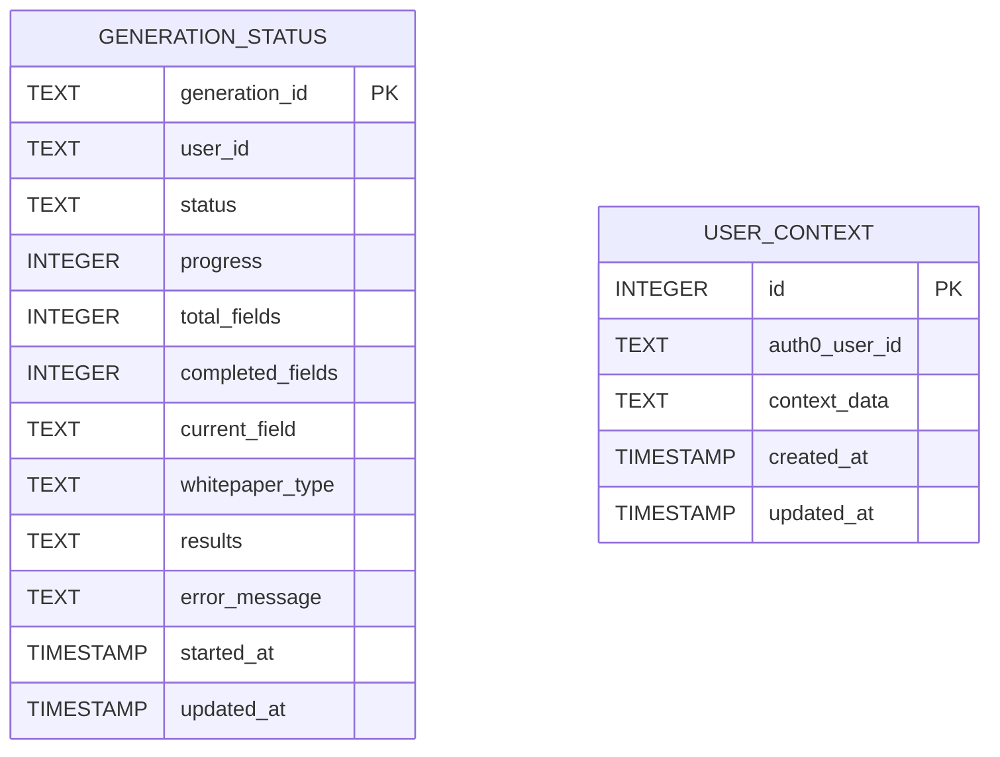
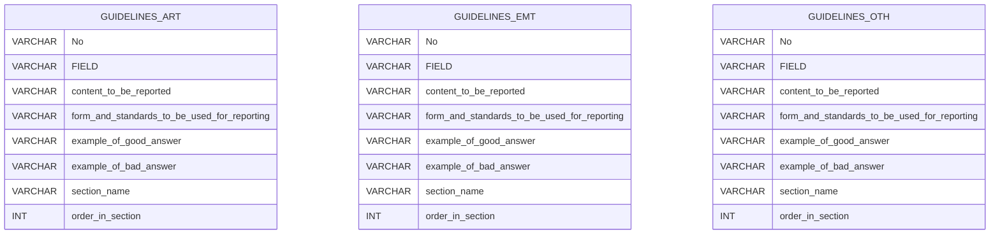
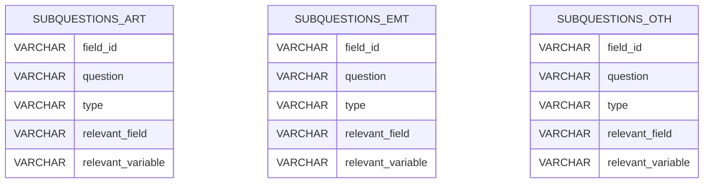

## Database schema diagrams (generated from `schema.txt`)

Note: Column names with spaces in the original schema were converted to snake_case for diagram compatibility. Primary keys are marked where explicitly defined.

### data_context.db

### guidelines.db

### subquestions.db

### oth_whitepaper_fields.db

```mermaid
erDiagram
    OTH_SECTION1 {
        INTEGER id PK
        TEXT field_name
        TEXT field_id
    }
    OTH_SECTION2 {
        INTEGER id PK
        TEXT field_name
        TEXT field_id
    }
    OTH_SECTION3 {
        INTEGER id PK
        TEXT field_name
        TEXT field_id
    }
    OTH_SECTION4 {
        INTEGER id PK
        TEXT field_name
        TEXT field_id
    }
    OTH_SECTION5 {
        INTEGER id PK
        VARCHAR field_name
        VARCHAR field_id
    }
    OTH_SECTION6 {
        INTEGER id PK
        VARCHAR field_name
        VARCHAR field_id
    }
    OTH_SECTION7 {
        INTEGER id PK
        TEXT field_name
        TEXT field_id
    }
    OTH_SECTION8 {
        INTEGER id PK
        TEXT field_name
        TEXT field_id
    }
    OTH_SECTION9 {
        INTEGER id PK
        TEXT field_name
        TEXT field_id
    }
    OTH_SECTION10 {
        INTEGER id PK
        TEXT field_name
        TEXT field_id
    }
    OTH_SECTION11 {
        INTEGER id PK
        TEXT field_name
        TEXT field_id
    }
    OTH_SECTION13 {
        INTEGER id PK
        TEXT field_name
        TEXT field_id
    }
```

### emt_whitepaper_fields.db

```mermaid
erDiagram
    EMT_SECTION1 {
        INTEGER id PK
        TEXT field_name
        TEXT field_id
    }
    EMT_SECTION2 {
        INTEGER id PK
        TEXT field_name
        TEXT field_id
    }
    EMT_SECTION3 {
        INTEGER id PK
        TEXT field_name
        TEXT field_id
    }
    EMT_SECTION4 {
        INTEGER id PK
        TEXT field_name
        TEXT field_id
    }
    EMT_SECTION5 {
        INTEGER id PK
        VARCHAR field_name
        VARCHAR field_id
    }
    EMT_SECTION6 {
        INTEGER id PK
        VARCHAR field_name
        VARCHAR field_id
    }
    EMT_SECTION7 {
        INTEGER id PK
        TEXT field_name
        TEXT field_id
    }
    EMT_SECTION8 {
        INTEGER id PK
        TEXT field_name
        TEXT field_id
    }
    EMT_SECTION13 {
        INTEGER id PK
        TEXT field_name
        TEXT field_id
    }
```

### art_whitepaper_fields.db

```mermaid
erDiagram
    ART_SECTION1 {
        INTEGER id PK
        TEXT field_name
        TEXT field_id
    }
    ART_SECTION2 {
        INTEGER id PK
        TEXT field_name
        TEXT field_id
    }
    ART_SECTION3 {
        INTEGER id PK
        TEXT field_name
        TEXT field_id
    }
    ART_SECTION4 {
        INTEGER id PK
        TEXT field_name
        TEXT field_id
    }
    ART_SECTION5 {
        INTEGER id PK
        VARCHAR field_name
        VARCHAR field_id
    }
    ART_SECTION6 {
        INTEGER id PK
        VARCHAR field_name
        VARCHAR field_id
    }
    ART_SECTION7 {
        INTEGER id PK
        TEXT field_name
        TEXT field_id
    }
    ART_SECTION8 {
        INTEGER id PK
        TEXT field_name
        TEXT field_id
    }
    ART_SECTION9 {
        INTEGER id PK
        TEXT field_name
        TEXT field_id
    }
    ART_SECTION10 {
        INTEGER id PK
        TEXT field_name
        TEXT field_id
    }
    ART_SECTION13 {
        INTEGER id PK
        TEXT field_name
        TEXT field_id
    }
```

<!-- If you want this rendered as SVG/PNG, you can use Mermaid-compatible renderers or the mermaid-cli (mmdc). -->

